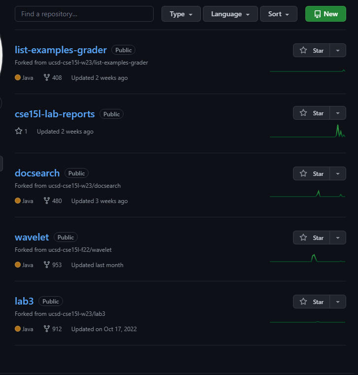
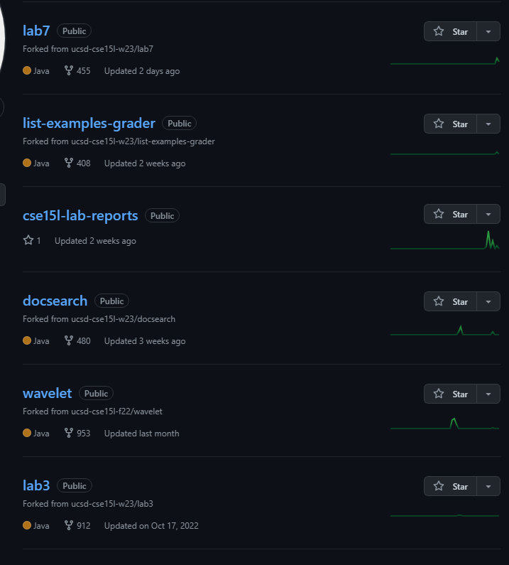
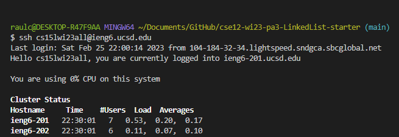
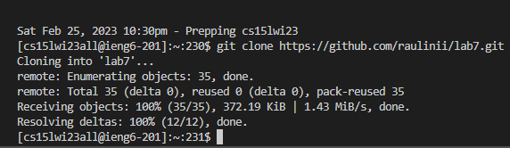
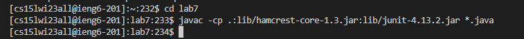
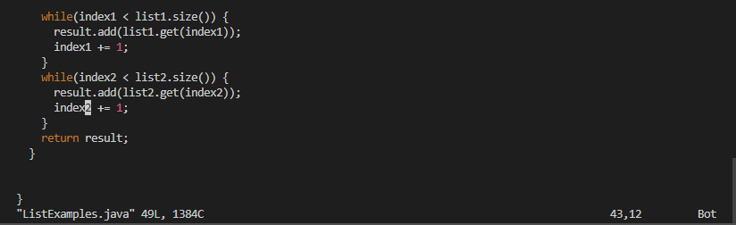

# Steps Used For Lab 4
This page will show the steps used to complete the tasks assigned to us.
## Step 1
The first step was to delete an exisiting forks of the repository. Since I already deleted the fork, I will show what my repository looks like with the fork not present:

## Step 2
The second step was to fork the repository that will be used later on. After forking, your repository page should look similar to this:

## Step 3
The third step is to start a timer to test yourself. In my case, I used the timer on my phone, but any timer can be used.
## Step 4
The fourth step is to login to ieng6 with my course specific account. Since I completed to setup for my personal device, I dont have to type in my password while logging in. Since I had previously logged in, the process was also simplified by using my arrow keys to access my bash history. The commands I used were `<up><enter>`.That process looks like this:

## Step 5
The fifth step was to clone my fork of the repository that was given to us earlier. Since I had previoulsy ran the command necessary, I was able to save time by using the following command `<up><up><up><up><enter>`. That process looked something like this: 

## Step 6
The sixth step was to run the JUnit tests given to us to show that they fail. Since I wasn't in the file that was just cloned, I had to use the command `cd lab7` in order to enter the file with the JUnit tests. Afterwards, the commands I used to run the tests were `<up><up><up><enter>`. That process looked something like this: 

## Step 7
The seventh step was to edit the code in order to fix the failing tests. In order to do this, I had to use the following command `vim ListExamples.java`. This allowed me to edit the code and fix the error inside. After fixing the error, I exited and saved the vim editor pressing `<esc><:><w><q>`. That process looked something like this: 

> The picture shown shows the portion of the code that had the error, however, the error is fixed. Also, this picture doesn't show the full vim editor or the command ran because while using the vim command, the editor is the only text visible in my terminal.

