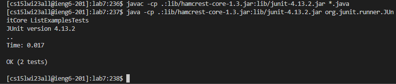
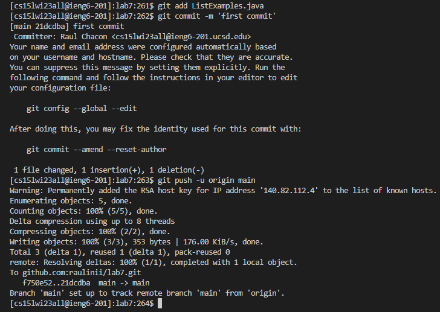

# Steps Used For Lab 4
This page will show the steps used to complete the tasks assigned to us.
## Step 4
The fourth step is to login to ieng6 with my course specific account. Since I completed the setup for my personal device, I dont have to type in my password while logging in. Since I had previously logged in, the process was also simplified by using my arrow keys to access my bash history. The commands I used were `<up><enter>`.That process looks like this:

## Step 5
The fifth step was to clone my fork of the repository that was given to us earlier. Since I had previoulsy ran the command necessary, I was able to save time by using the following command `<up><up><up><up><enter>`. That process looked something like this: 

## Step 6
The sixth step was to run the JUnit tests given to us to show that they fail. Since I wasn't in the file that was just cloned, I had to use the command `cd lab7` in order to enter the file with the JUnit tests. Afterwards, the commands I used to run the tests were `<up><up><up><enter>` and `<up><up><enter>`. That process looked something like this: 

## Step 7
The seventh step was to edit the code in order to fix the failing tests. In order to do this, I had to use the following command `vim ListExamples.java`. This allowed me to edit the code and fix the error inside. After fixing the error, I exited and saved the vim editor pressing `<esc><:><w><q>`. That process looked something like this: 

> The picture shown shows the portion of the code that had the error, however, the error is fixed. Also, this picture doesn't show the full vim editor or the command ran because while using the vim command, the editor is the only text visible in my terminal.
## Step 8
The eighth step was to run the tests to show that they now work. Instead of typing the full commands, which are `javac -cp .:lib/hamcrest-core-1.3.jar:lib/junit-4.13.2.jar *.java` and `java -cp .:lib/hamcrest-core-1.3.jar:lib/junit-4.13.2.jar org.junit.runner.JUnitCore ListExamplesTests`, I used the following commands `<up><up><up><enter>` for the first command and `<up><up><enter>` for the second. The process looked something like this: 

## Step 9
The ninth step was to commit and push the changes into my github account. The commands I used were `git add ListExamples.java`, then `git commit 'first commit'`, and finally pushing with `git -u push origin main`. The process looked something like this: 

