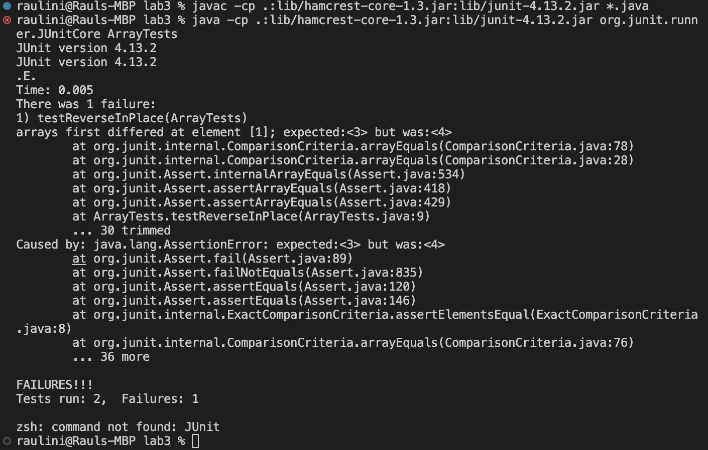

# Servers and Bugs
## Purpose of this Lab
The purpose of this lab is to create a simple web server called StringServer that takes in Strings as inputs and displays them on the web server. Along with the web server, we must also identify bugs in code provided during the Lab on week 3 and come up with ways to fix the bugs.
## Part 1 - Web Server
The following code block displays the code I made in order to process and display the Strings on my web server.
```
import java.io.IOException;
import java.net.URI;

class Handler implements URLHandler {
    // The string that will be modified after taking in requests
    String input = "";

    public String handleRequest(URI url) {
        if (url.getPath().equals("/")) {
            return String.format(input);
        } else if (url.getPath().contains("/add-message")) {
            String[] parameters = url.getQuery().split("=");
            if (parameters[0].equals("s")) {
                    input += (parameters[1] + "\n");
                    return String.format(input);
                }     
            }
        return String.format(input);
    }
}

class StringServer {
    public static void main(String[] args) throws IOException {
        if(args.length == 0){
            System.out.println("Missing port number! Try any number between 1024 to 49151");
            return;
        }

        int port = Integer.parseInt(args[0]);

        Server.start(port, new Handler());
    }
}
```
The following screenshots show the web server taking in requests that modify the page. The requests have a format that looks like this :
`/add-message?s=<string>`

Example 1:


- In the following image, the method that is called is `public String handleRequest(URI url)`
- Some important fields and arguments of this method are the `url` parameter and the String value labeled `input`
- After taking in the request `/add-message?s=Hello`, the `url` parameter gets changed to the new url of the web server. After the code executes, input is changed to the String at the end of the request. In this example, that string is `Hello`
- Now that the method has run, as shown in the image, the web server will now display:
```
Hello
```

Example 2:


- In the following image, the method that is called is `public String handleRequest(URI url)`
- Some important fields and arguments of this method are the `url` parameter and the String value label `input`
- After taking in the request `/add-message?s=How are you`, the `url` parameter gers changed to the new url of the web server. After the code executes, input is changed to the string at the end of the request. In this example, that string is `How are you`
- Now that the method has run, as shown in the image, the web server will now display: 
```
Hello
How are you
```
---
## Part 2 - Bugs from Lab 3
The following code blocks are from the examples provided to us from Lab 3. The first code block is the actual code, while the second code block consists of a junit test that relates to the first code block.
```
public class ArrayExamples {

  // Changes the input array to be in reversed order
  static void reverseInPlace(int[] arr) {
    for(int i = 0; i < arr.length; i += 1) {
      arr[i] = arr[arr.length - i - 1];
    }
  }
```
- Actual code being ran is shown above:
```
public class ArrayTests {
	@Test 
	public void testReverseInPlace() {
    int[] input1 = {0};
    ArrayExamples.reverseInPlace(input1);
    assertArrayEquals(new int[]{0}, input1);
	}
```
- The test being used to test the first code block is shown above:
> Note: The "0" values that are shown above are placeholders and are changed as different tests are created.

The first code block shown above has some bugs to it. The purpose of the code is reverse an input array, however, when trying certain values, the code does not work as intended. For example, when setting the input array as `int[] = {3,4}` and running the code, the array that will be returned contains the values {4,4}. The input that makes the code not work as intended looks like this:
```
public class ArrayTests {
	@Test 
	public void testReverseInPlace() {
    int[] input1 = {3,4};
    ArrayExamples.reverseInPlace(input1);
    assertArrayEquals(new int[]{4, 3}, input1);
	}
```
While the first code block does have some bugs, there are some inputs that do work with the code. For example, if the input is just one value, lets say for example we create an array that looks like `int[] input1 = {0}` and run the method `testReverInPlace`, the code will work as intended. The output that we should expect is 0, which turns out to be the case after running the method. The input that makes the code work as intended looks like this:
```
public class ArrayTests {
	@Test 
	public void testReverseInPlace() {
    int[] input1 = {0};
    ArrayExamples.reverseInPlace(input1);
    assertArrayEquals(new int[]{0}, input1);
	}
```
The following images show the behavior of the codes when taking in a failure inducing input as well as an input that works:



- The image above shows the symptoms of a failure inducing input.


- The image above shows the symptoms of an input that works.
