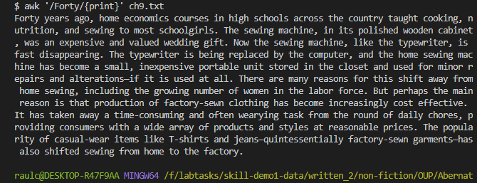
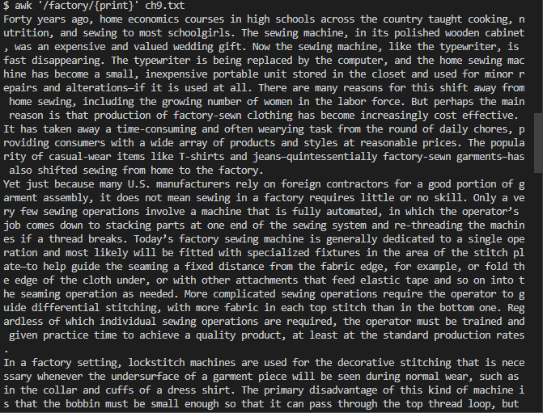
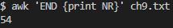
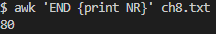
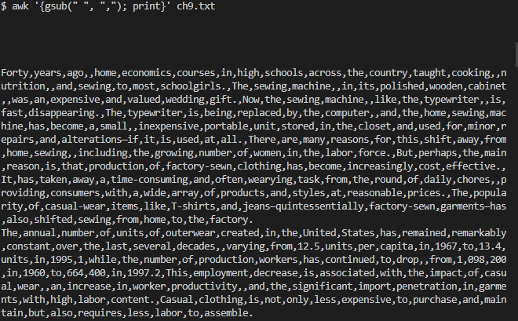
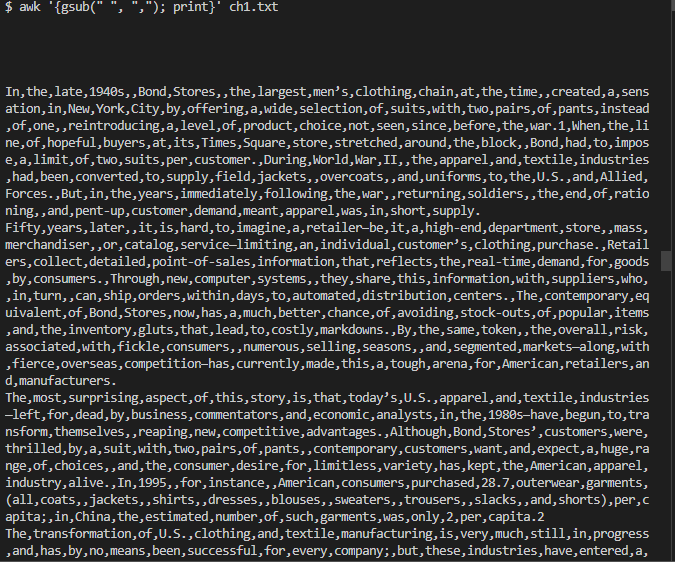
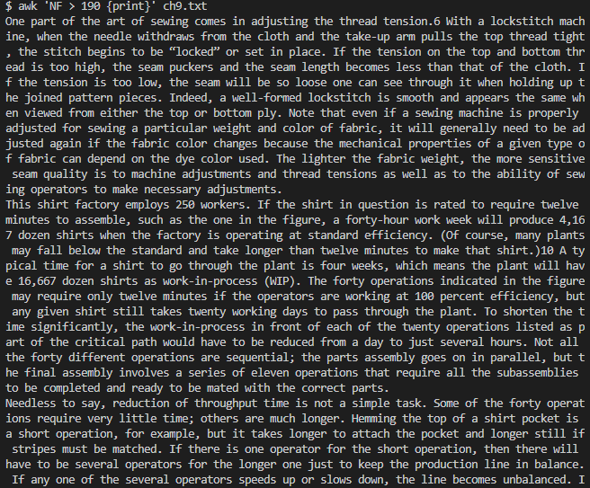
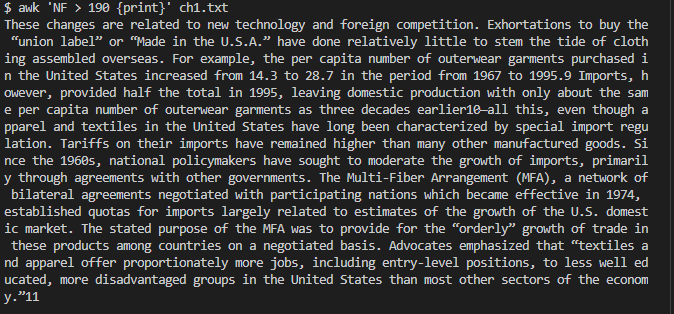

# Different Ways to Use Awk
## Purpose of This Lab
The purpose of this lab is to show the different ways of using the command `awk`.

# Example #1
> The following information was obtained from ChatGPT.

The first variation of `awk` is `awk '/example/ {print}' file.txt`. In the following code block, /example/ and file.txt are placeholder values that can be replaced with whatever is being searched for by the user. The command shown above does the following: it searches for the string inputted by the user and prints out the lines that contain the string that is being searched. The output looks something like this: 

>The image shown above had more text below what is actually shown, so I showed only showed a portion of the output.

# Example #2
> The following information was obtained from ChatGPT.

The second variation of `awk` is `awk 'END {print NR}' file.txt`. In the following code block, file.txt is a placeholder value for whatever file the user wants to search. This variation of awk prints out the lines within the file being searched. The process looks something like this: 

# Example #3
> The following information was obtained from ChatGPT.

The third variation of `awk` is `awk '{gsub(" ", ","); print}' file.txt`. In the following code block, file.txt is a placeholder value for whatever file the user wants to search. This variation of awk separates text by the desired user input. For example, in the code block shown above, commas are being used to separate the text within text files. While this might be a bit confusing to understand, the following output should make this command make more sense: 

> In both of the images shown above, there was too much text to fit in one image, however, I tried to fit in as much as I could.

# Example #4
> The following information was obtained from ChatGPT.

The fourth and final variation of `awk` is `awk 'NF > 4 {print}' file.txt`. In the following code block, the 4 and file.txt are placeholder values that are can be modified by the user. This variation of awk compares the number of fields within each line to the number inputted by the user. Again, since this code block could be a bit more difficult to understand, the images should make the process a bit clearer. The process looks something like this: 

