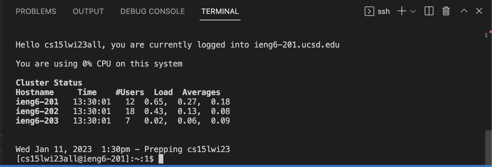

# Remote Access
The goal of this post is to guide new users through the setup process of their CSE15L account as well as providing instructions as to how to connect to a remote machine with Visual Studio Code.
## Setting Up CSE15L Account
1. The first step in connecting to ieng6 is setting up your CSE15L account. The details corresponding to your account will be located in the following link:(https://sdacs.ucsd.edu/~icc/index.php).
2. After finding your account you will be prompted to reset the password of your UCSD account. The instructions should be plentiful, however, if you are stuck you can refer to the following instructions: (https://docs.google.com/document/d/1hs7CyQeh-MdUfM9uv99i8tqfneos6Y8bDU0uhn1wqho/edit).
3. After changing the password there will be a 5-10 minute grace period to do the next step which is setting up Visual Studio Code in order to run ieng6.
## Visual Studio Code
1. Within the 10 minutes you have after changing your password for your UCSD account, it is important to download Visual Studio Code. Visual Studio Code is an editor that will allow you to connect to ieng6 with a few commands that will be mentioned later on. 
2. Visual Studio code is located at: (https://code.visualstudio.com/).
3. Upon entering the website, you will be met with a screen similar to this:
 
4. Since there is different download files for different operating systems, download the one that is corresponding to your machine.
5. After downloading and opening Visual Studio Code, you will be met with a screen similar to this: 

6. Congratulations, you have successfully set up Visual Studio Code on your personal device. By this point, the password on your UCSD account should be updated, which allows us to continue onto the next step which is connecting to ieng6 remotely.
## Connecting to Remote Access
1. Now that you have Visual Studio Code downloaded, you will create a folder labeled CSE15. It can be named whatever you'd like, the name really just serves as a way to organize your data.
2. There are multiple ways to create/access folders within VS Code, however, my personal favorite is right-clicking the blank space on the left side of the application. Once you right-click the left side, you should see a screen similar to this:

3. From here you will create a new folder and label it whatever you'd like. 
4. After creating your folder, you will right-click the same place and click on the "Open in Integrated Terminal" option. 
5. Upon opening your terminal you will use "ssh" in order to remotely connect.
6. In order to continue you must have your course-specific CSE15L account, which should look something like cs15lwi23***, with the asterisks being placeholders for your specific information.
7. You will now click on your terminal and type out the following command: ssh cs15lwi23***@ieng6.ucsd.edu
8. If it is your first time logging in, you will be met with text in your terminal (I can't provide the text as I have already connected before and never took a screenshot of the text), as well as the option to continue by typing (yes/no/[fingerprint]). Upon seeing a message similar to this, type out yes in your terminal to continue connecting.
9. Upon typing yes, you will be met with text asking you to put your password. That text should look something like this: 

10. The password that you will use is the same one that you changed 10-15 minutes prior to getting to this step.
11. Upon connection your terminal will show you information like CPU usage and time connected. Your terminal should look like this: 

12. Congratulations! If you're terminal looks similar to the screenshot above, you have successfully completed this step.
## Running Commands
1. Now that you have successfully connected to a remote machine, you can try various commands in your terminal. There is a plethora of commands that you can run, however, some basic and useful commands consist of the following:
   * cd
   * cd ~
   * ls -a
   * pwd
2. If you have done everything right up to this point, after typing the commands, you should see results similar to this: 

3. Congratulations, you have successfully run commands on a remote machine. If you'd like to exit, you can run the following command in your terminal: 
   * exit

Or, you can do the shortcut on your keyboard which is: 
   * Ctrl-D
